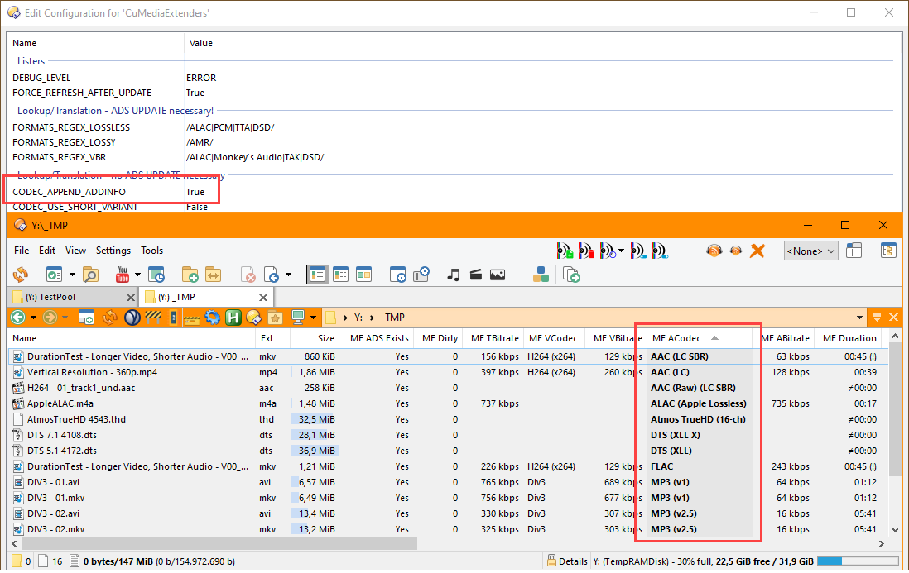
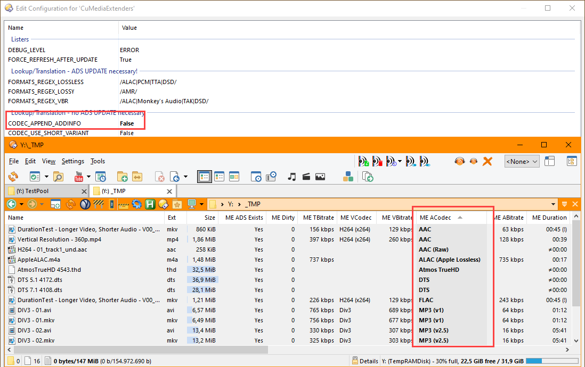
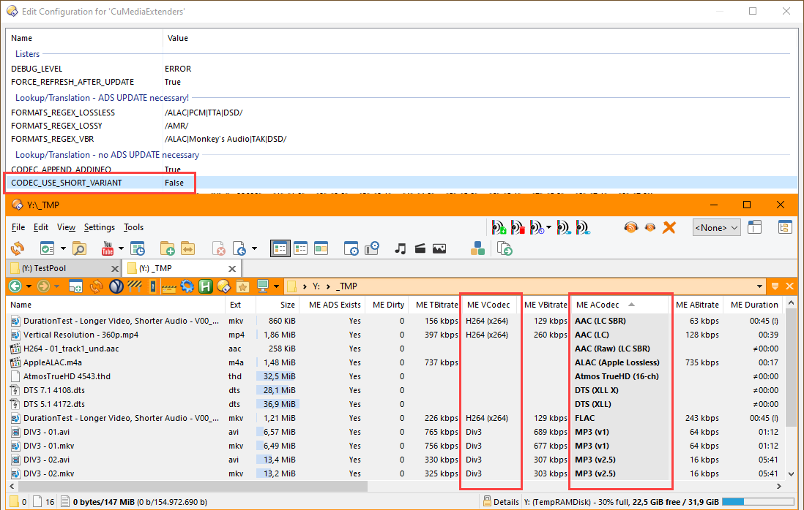
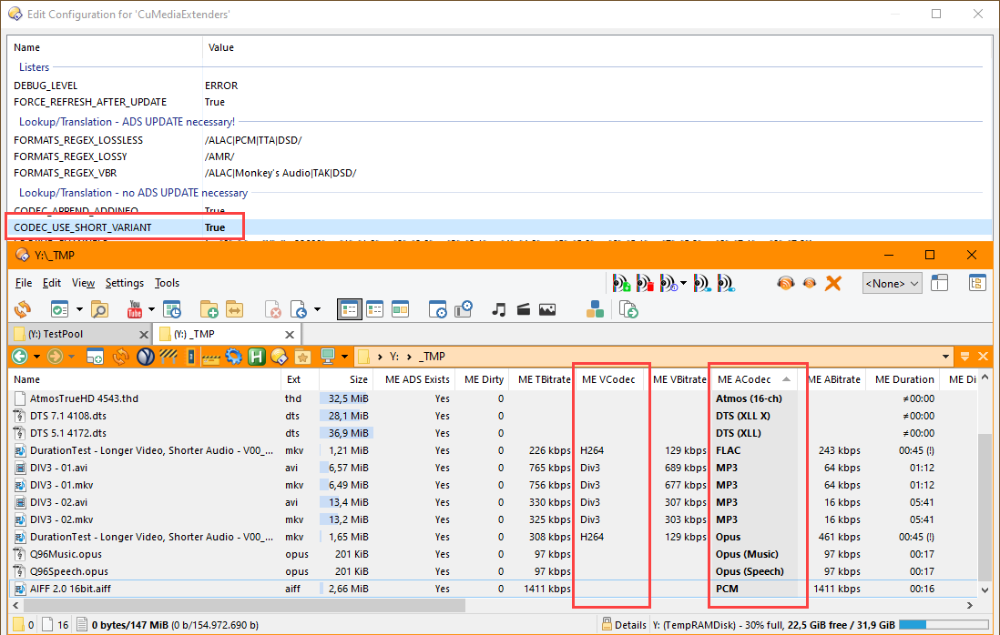
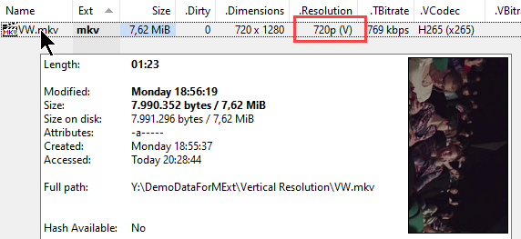
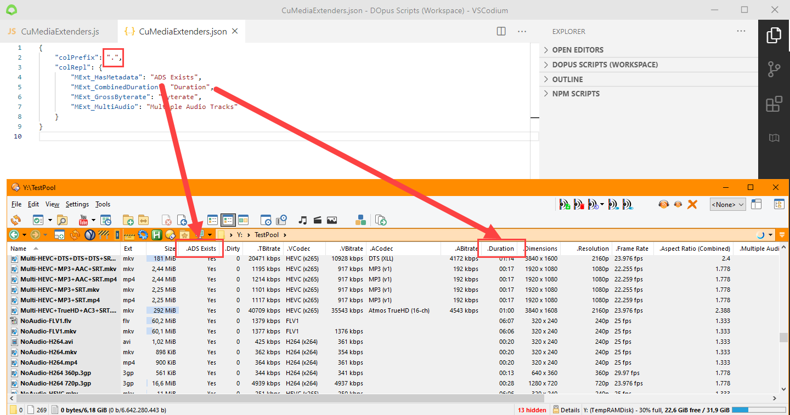

# Configuration

* [Quick Start](#Quick-Start)
* [UI Options](#UI-Options)
* [More on Individual Settings](#More-on-Individual-Settings)
    * [Additional Info](#Additional-Info)
    * [Short Variant](#Short-Variant)
    * [Vertical Videos](#Vertical-Videos)
* [Customizing Column Labels](#Customizing-Column-Labels)
    * [Why external JSON and restart](#Why-external-JSON-and-restart)
* [LOOKUP_CODECS](#LOOKUP_CODECS)
    * [Example](#Example)
    * [Thoughts on FourCC](#Thoughts-on-FourCC)


# Quick Start

If you want to adjust the VCodec & ACodec output, see options:

* CODEC_USE_SHORT_VARIANT: user switch
* CODEC_APPEND_ADDINFO: some codecs supply additional information
* RESOLUTION_APPEND_VERTICAL: user string
* LOOKUP_CODECS: use as the last resort

If you want to customize column labels see [Customizing Column Labels](#Customizing Column Labels) below.

For the JSON formatted variables, please keep these in mind:

* JSON strings must be double-quoted ("); single quotes (') will be rejected by JSON parser
* The last line of arrays/objects may NOT have a trailing comma
* No comments whatsoever

💡 *Suggestion: For bigger changes, edit the text in an external editor, e.g. VSCode, Notepad++, etc.*


# UI Options

All UI options have quick descriptions.

| Name                              | Type | Default | Remarks |
| --------------------------------- | ---------- | ------------- | ------- |
| DEBUG_LEVEL                       | enum | ERROR | Level of output messages in the Script Log (aka Output Log) shown by the script.<br /><br />Unless you are adventurous, do not set it above WARN, i.e. NORMAL, INFO, VERBOSE emita ton of information and might freeze your PC/DOpus.<br /><br />The log can be opened by via:<br />* View -> Output Window<br />* by the command `Set UTILITY=OtherLog,Toggle`<br />* by opening Find, Synchronize, etc. and choosing "Other Log" in the "Utility Panel" dropdown |
| FORCE_REFRESH_AFTER_UPDATE        | boolean | true<br /><br />*will be hidden in near future* | Automatically refresh the current lister after changes.<br /><br />It keeps the current selection. |
| MEDIAINFO_PATH                    | string | /programfilesx86/MediaInfo/MediaInfo.exe | Path to MediaInfo portable CLI.<br /><br />It can be downloaded from [https://mediaarea.net/en/MediaInfo/Download/Windows](https://mediaarea.net/en/MediaInfo/Download/Windows) |
| TEMP_FILES_DIR                    | string | %TEMP% | Temporary directory, in which temporary JSON outputs from MediaInfo are stored.<br /><br />They are immediately deleted after a file has been processed.<br /><br />This is ignored in Templess Mode (see below). |
| TEMPLESS_MODE                     | boolean | false | *Experimental:*<br /><br />In this mode, MediaInfo outputs are read into the script without using temporary files.<br /><br />This is a highly experimental feature and uses temporary (volatile) environment variables to pass the data from the command output to DOpus.<br /><br />If you are lucky, it might work just as fast as, if not faster than the normal mode using temp-files. If not, disable it again. |
| TEMPLESS_CHUNK_SIZE               | number | 32768 | Experimental:<br /><br />Determines how big the chunks, i.e. volatile envvar blocks, should be. Windows has certain limitations on command line and envvar lengths. If templess mode works mostly for you, you can increase the value even further.<br /><br />The default value is chosen very conservatively. |
| KEEP_ORIG_MODTS                   | boolean | true<br /><br />*will be hidden in near future* | Attaching ADS to files normally changes the *last modification* timestamps of the parent file.<br /><br />* true: The script automatically resets the timestamp to original.<br />* false: The parent files' modification timestamp is changed. |
| CACHE_ENABLED                     | boolean | true | Cache metadata JS objects in memory for unchanged files to speed up process.<br/><br/>The information stored in ADS is usually small, typically ~1 KB per file, but I cannot guarantee how much memory management overhead Windows/WSH/JScript/DOpus put on top of each object. The cache is used only and only if this script runs, i.e. automatically when any of the columns is visible (incl. in InfoTips/Tiles), or if you trigger a command.<br/><br/>To ensure the information is always up-to-date, the following algorithm is used:<br/><br/>* Caching disabled or file is not in cache => read from disk<br/><br/>* File is already in cache => check file's last modification time against the timestamp in cached info<br/> * If different => read from disk<br/> * If same => use cache<br/>* UPDATE command executed (regardless of file was in cache or not) => add to/update cache<br/>* File is already in cache but DELETE command is executed => remove from cache<br/><br/>WARNING:<br/><br/>The cache will fail for one particular scenario:<br/><br/>Say, you have a file and you copy it to another folder. If the copy is processed, its information will be cached. If you delete the copy via DOpus (or some other program), the script will not receive this information automatically. If you copy the original file, which has the exact same file size & modification timestamp, to the same path again, the new copy will have no ADS but the script will still think that the it is the previously processed file and show the information from the cache. Normally this is not a problem for displaying purposes, but if you copy the copy to another drive, it will have no ADS. If you do this, you should either manually update the 2nd copy, or delete the cache to see that the copy has no ADS.<br/><br/>Please keep this in mind.<br/><br/>CAVEATS:<br/><br/>If you keep DOpus open for a long time and handle thousands of small files (only when any of these extra columns is shown), the memory usage of DOpus will increase. This is not a 'memory leak' though, just the script doing what you tell it to: To cache stuff :)<br/><br/>To avoid high mem usage you can manually call the CLEARCACHE command via button, menu... |
| TOGGLEABLE_FIELDS_ESSENTIAL       | string[] as json | [<br/>  "MExt_HasMetadata",<br/>  "MExt_NeedsUpdate",<br/>  "MExt_TotalBitrate",<br/>  "MExt_VideoCodec",<br/>  "MExt_VideoBitrate",<br/>  "MExt_AudioCodec",<br/>  "MExt_AudioBitrate",<br/>  "MExt_CombinedDuration",<br/>  "MExt_VDimensions",<br/>  "MExt_VResolution",<br/>  "MExt_VFrameRate",<br/>  "MExt_VARCombined",<br/>  "MExt_MultiAudio",<br/>  "MExt_AudioChannels",<br/>  "MExt_AudioLang",<br/>  "MExt_AudioBitrateMode",<br/>  "MExt_AudioCompressionMode",<br/>  "MExt_HasReplayGain",<br/>  "MExt_VBitratePerPixel",<br/>  "MExt_SubtitleLang"<br/>] | *Essential* columns list, which can be toggled on/off via supplied button (default icon: 1).<br /><br />The list is ordered, i.e. they are added/removed in the same order as configured.<br /><br />Unlike the list might suggest, you can use any DOpus field in this list, e.g. mix and match standard movie/audio fields from DOpus.<br /><br />Also see the next setting TOGGLEABLE_FIELDS_ESSENTIAL_AFTER. |
| TOGGLEABLE_FIELDS_ESSENTIAL_AFTER | string | Comments | The column name after which the *Essential* fields are added to/removed from.<br /><br />Can also be one a DOpus built-in field, as in the default. |
| TOGGLEABLE_FIELDS_OPTIONAL        | string[] (as json) | [<br>    "MExt_GrossByterate",<br>    "MExt_TotalDuration",<br>    "MExt_VideoDuration",<br>    "MExt_AudioDuration",<br>    "MExt_VARDisplay",<br>    "MExt_VARRaw",<br>    "MExt_VideoCount",<br>    "MExt_AudioCount",<br>    "MExt_TextCount",<br>    "MExt_OthersCount",<br>    "MExt_VEncLibName",<br>    "MExt_VEncLib",<br>    "MExt_VCodecID",<br>    "MExt_ACodecID",<br>    "MExt_AFormatVersion",<br>    "MExt_AProfile",<br>    "MExt_EncoderApp",<br>    "MExt_DateEncoded",<br>    "MExt_DateTagged",<br>] | *Optional* columns list, which can be toggled on/off via supplied button (default icon: 2).<br><br />The rest as in *Essential* fields above. |
| TOGGLEABLE_FIELDS_OPTIONAL_AFTER  | string | MExt_SubtitleLang | The column name after which the *Optional* fields are added to/removed from. |
| TOGGLEABLE_FIELDS_OTHER           | string[] (as json)         | [<br>    "MExt_HelperContainer",<br>    "MExt_HelperVideoCodec",<br>    "MExt_HelperAudioCodec",<br>    "MExt_CleanedUpName",<br>] | *Other* columns list, which can be toggled on/off via supplied button (default icon: 3).<br/><br />These fields are usually unnecessary for daily usage..<br /><br />The rest as in *Essential* fields above. |
| TOGGLEABLE_FIELDS_OTHER_AFTER     | string | <none> | The column name after which the *Other* fields are added to/removed from. |
| TOGGLEABLE_FIELDS_VERBOSE         | string[] (as json) | [<br>    "MExt_ADSDataFormatted",<br>    "MExt_ADSDataRaw",<br>] | Verbose columns list, which can be toggled on/off via supplied button (default icon: 4).<br/><br />These fields are usually unnecessary for daily usage..<br /><br />The rest as in *Essential* fields above. |
| TOGGLEABLE_FIELDS_VERBOSE_AFTER   | string | <none> | The column name after which the *Verbose* fields are added to/removed from. |
| CODEC_USE_SHORT_VARIANT           | boolean | false | Use short variants of codecs, found via LOOKUP_CODECS |
| CODEC_APPEND_ADDINFO              | boolean | true | Add container or codec-specific information to the container/video/audio codec fields automatically.<br />If an AAC file is encoded with 'LC SBR' it is shown as 'AAC (LC SPR)'. |
| RESOLUTION_APPEND_VERTICAL        | string | " (Vertical)"  | Append a suffix to video resolutions, mostly relevant for mobile phone videos. Can be empty.<br /><br />*Example: A file with with 480x640 resolution, will be shown as 480p (Vertical).* |
| FORMATS_REGEX_VBR                 | regexp (as string) | /ALAC\|Monkey's Audio\|TAK\|DSD/ | Audio formats which do not store a VBR/CBR/ABR information separately but are VBR by definition.<br />*Do not change unless necessary.* |
| FORMATS_REGEX_LOSSLESS            | regexp (as string) | /ALAC\|PCM\|TTA\|DSD/ | Audio formats which do not store a lossless information separately but are lossless by definition.<br /><br />*Do not change unless necessary.* |
| FORMATS_REGEX_LOSSY               | regexp (as string) | /AMR/ | Audio formats which do not store a lossy information separately but are lossy by definition.<br /><br />*Do not change unless necessary.* |
| LOOKUP_RESOLUTIONS                | <string, string> (as json) | {<br>    "240":      "240p",<br>    "360":      "360p",<br>    "480":      "480p",<br>    "576":      "576p",<br>    "720":      "720p",<br>    "1080":     "1080p",<br>    "2160":     "2160p",<br>    "4320":     "4320p"<br>} | Video resolution translation hash. These are also used for grouping. For calculation always, the smaller of width/height is taken. Also see RESOLUTION_APPEND_VERTICAL. <br /><br />The comparison is always <= (less or equal), i.e.<br />*actual resolution <= config values*<br /><br />Alternatively, you can use SD, HD-Ready, HD, UHD, 4K, 8K, etc.<br /><br />*Example: A file with with 640x480 resolution, will be shown as 480p.* |
| LOOKUP_DURATION_GROUPS            | <string, string> (as json) | {<br>    "0":        " ≠00:00",<br>    "60":       "< 01:00",<br>    "120":      "01:00-02:00",<br>    "180":      "02:00-03:00",<br>    "240":      "03:00-04:00",<br>    "300":      "04:00-05:00",<br>    "600":      "05:00-10:00",<br>    "900":      "10:00-15:00",<br>    "1200":     "15:00-20:00",<br>    "1800":     "20:00-30:00",<br>    "3600":     "30:00-1:00:00",<br>    "5400":     "Over 1h",<br>    "7200":     "Over 1.5h",<br>    "10800":    "Over 2h",<br>    "999999":   "Over 3h"<br>} | Duration lookup hash. These are also used for grouping.<br /><br />The comparison is always <= (less or equal), i.e.<br />*actual duration <= config values*<br/><br />Some raw files extracted from movie containers, notably raw AAC (not M4A), raw DTS, raw Atmos are reported as having a 0 duration by MediaInfo. But if the file definitely has audio, you can recognize this as well.<br /><br/> \u2260 is the Unicode 'not equal' sign.<br/> <br />If the file has no audio track at all, this is grouped automatically under 'No Audio', no need to define it here.<br/><br />Also note that some values like 'Over 1h' depend on preceeding key's value |
| LOOKUP_CODECS                     | <string, string> (as json) | *see [LOOKUP_CODECS](#LOOKUP_CODECS) below* | |
| LOOKUP_CHANNELS                   | <string, string> (as json) | {<br>    "0": " ",<br>    "X": "≠0",<br>    "1": "1.0",<br>    "2": "2.0",<br>    "3": "2.1",<br>    "4": "4.0",<br>    "5": "5.0",<br>    "6": "5.1",<br>    "7": "5.2",<br>    "8": "7.1",<br>    "9": "7.2"<br>} | 0 means file has no audio track<br />X: means file has an audio track, but its channel information cannot be extracted by MediaInfo. Some formats like Musepack, raw DTS report an audio track but not the channel count, sorted between 0 & 1.<br/><br />Some alternatives for 0:<br />* "0": "0 (no audio)"<br/>* "0": "0 (n/a)"<br/>* "0": "0"<br/>If you use "0": "" the value 0 will be shown as empty string as well, which impacts sorting.<br /><br />Some alternatives for X:<br />* "X": "> 0",<br />* "X": "≠ 0" |
| NAME_CLEANUP                      |  |  | Currently only for internal use. |


# More on Individual Settings


## Additional Info
Below is the "Additional Info" setting which affects only a handful of codecs like AAC, DTS, Atmos.
This info comes straight from MediaInfo, except Opus files, which the script fills separately for you.
Note how "AAC (LC SBR)" becomes "AAC" and so on, but not MP3.






## Short Variant

You might be confused why MP3 (v1) was identical on both sides in the screenshot above,
because this is technically not from "Additional Info" field, but you can still use the "short versions" as seen below.





Where do these *Short Variants* come from? See [LOOKUP_CODECS](#lookup_codecs) below.


## Vertical Videos

You can add a suffix to Resolution field, if the height is bigger than the width, usually mobile phone videos.
If you don't want it, simply delete the value. If you enter "` (V)`" this is how it will be shown.




# Customizing Column Labels

All built-in column names can be customized without editing source code.

If you create a .JSON file, with the same name as the script's, in "`/dopusdata/Script AddIns`"
this file will be automatically used.

**Important:** This must be valid, parsable JSON (only double quotes, no trailing commas, and so on),
otherwise it will be ignored. A message is shown if this happens.

You can use following keys; all keys are optional:


| Key Name       | Type   | Description                                                                                          |
| ---------------- | -------- | ------------------------------------------------------------------------------------------------------ |
| colPrefix?     | string | Prefix for all columns. If empty default ("ME ") will be used. Examples: " ", "."                    |
| colRepl?       | object | Replacement hash, where you can replace the default script label with your own.                      |
| colExtra?      | object | User-definable hash, which can use fields from the "extra" field for the **container**.              |
| colExtraVideo? | object | User-definable hash, which can use fields from the "video_extra" field for the **first video track**. |
| colExtraAudio? | object | User-definable hash, which can use fields from the "audio_extra" field for the **first audio track**. |

In order to find if and which "Extra*" fields are available, you can use one of the "Other" or "Verbose" fields,
or set up tooltips as described in "How/Where to Use" section.

*Note:* The "Extra*" fields are not always available for all files,
it is highly dependent on the codec, container, file and encoder/muxer app.
For example, Youtube videos often contain "video_extra" for video track, but rarely "extra" for the container.

Sample file:

```json
{
    "colPrefix": ".",
    "colRepl": {
        "MExt_HasMetadata": "ADS?",
        "MExt_CombinedDuration": "Duration",
        "MExt_GrossByterate": "Byterate",
        "MExt_MultiAudio": "Multi-Track",
        "MExt_VARCombined": "AspectRatio",
        "MExt_AudioChannels": "Channels",
        "MExt_AudioCompressionMode": "ACompMode"
    },
    "colExtra": {
        "com_apple_quicktime_model": "Camera Make",
        "com_apple_quicktime_software": "Camera Software"
    },
    "colExtraVideo": {
        "CodecConfigurationBox": "Codec Config Box"
    },
    "colExtraAudio": {
        "Source_Delay": "Source Delay"
    }
}
```

Once configured it should look like this:


**❗ Important:** After changes you have to restart DOpus or disable and re-enable the script for changes to take effect.

## Why external JSON and restart

Script column labels can be set only during script *initialization*, the OnInit() method automatically called by DOpus.
This method is executed not when the script is run, but when it is loaded into DOpus.
This happens once: either when you import a script into DOpus or change & save the script, basically a re-import.

During OnInit() scripts have no access to user configuration but only its preset defaults,
that is a script has no chance of reading customized labels, even if there were UI options for it.


# LOOKUP_CODECS

💡 *Suggestion:
Similar to "Extra" section above, you can use one of the "Other" or "Verbose" fields,
or set up tooltips as described in "How/Where to Use" section.
You can also use Copy/Dump buttons.*

There are a many different video & audio codecs, with many revisions, versions, vendor and program specific settings,
and showing a "codec name" is not as easy as it may sound.

LOOKUP_CODECS fixes this by giving you the complete control.
It is the most flexible & powerful but also most complicated part of this script.

Fields for **videos** are first upper-cased and probed in the following order to find a matching codec name:

1. CONTAINER_FORMAT - VIDEO_FORMAT - VIDEO_CODEC - ENC_LIBNAME
2. CONTAINER_FORMAT - VIDEO_FORMAT - VIDEO_CODEC
3. CONTAINER_FORMAT - VIDEO_FORMAT - ENC_LIBNAME
4. CONTAINER_FORMAT - VIDEO_FORMAT
5. CONTAINER_FORMAT - VIDEO_CODEC
6. VIDEO_FORMAT - VIDEO_CODEC - ENC_LIBNAME
7. VIDEO_FORMAT - VIDEO_CODEC
8. VIDEO_FORMAT - ENC_LIBNAME
9. VIDEO_FORMAT
10. VIDEO_CODEC

Fields for **audios** are first upper-cased and probed in the following order to find a matching codec name:

1. CONTAINER_FORMAT - AUDIO_FORMAT - AUDIO_CODEC - AUDIO_FORMAT_VERSION - AUDIO_FORMAT_PROFILE - AUDIO_SETTINGS_MODE
2. CONTAINER_FORMAT - AUDIO_FORMAT - AUDIO_CODEC - AUDIO_FORMAT_VERSION - AUDIO_FORMAT_PROFILE
3. CONTAINER_FORMAT - AUDIO_FORMAT - AUDIO_CODEC - AUDIO_FORMAT_VERSION
4. CONTAINER_FORMAT - AUDIO_FORMAT - AUDIO_CODEC
5. CONTAINER_FORMAT - AUDIO_FORMAT
6. AUDIO_FORMAT - AUDIO_CODEC - AUDIO_FORMAT_VERSION - AUDIO_FORMAT_PROFILE - AUDIO_SETTINGS_MODE
7. AUDIO_FORMAT - AUDIO_CODEC - AUDIO_FORMAT_VERSION - AUDIO_FORMAT_PROFILE
8. AUDIO_FORMAT - AUDIO_CODEC - AUDIO_FORMAT_VERSION
9. AUDIO_FORMAT - AUDIO_CODEC
10. AUDIO_FORMAT
11. AUDIO_CODEC
12. AUDIO_FORMAT - AUDIO_FORMAT_PROFILE  (mainly for MP3)

The more specific items, i.e. items near the top, should be preferred,
but they should be non-specific enough in case they are embedded in a movie file.

This is why you should prefer AAC-MP4A-40-2 or AAC to MKA-AAC-MP4A-40-2 or MP4-AAC-MP4A-40-2
otherwise you would have to re-declare the same codecs over and over for every movie container
use one of the helper columns if you find something which is not shown to your liking.


## Example

Given this block for H264 encoded files:

```json
"AVC-AVC1-X264"            : ["H264 (x264)", "H264"],
"AVC-H264-X264"            : ["H264 (x264)", "H264"],
"AVC-V_MPEG4/ISO/AVC-X264" : ["H264 (x264)", "H264"],
"AVC-X264"                 : ["H264 (x264)", "H264"],
"AVC-AVC1"                 : "H264",
"AVC"                      : "H264",
```

Assume a file has VIDEO_FORMAT (AVC) & VIDEO_CODEC (avc1) fields, and no CONTAINER_FORMAT or ENCLIB_NAME.
A missing CONTAINER_FORMAT is very unlikely and would be something like "MPEG-4" but assume it's the case for demonstration purposes.
ENCLIB_NAME is more likely to not exist.

The script will:

* first upper-case AVC & avc1 to AVC & AVC1
* use empty strings "" for CONTAINER_FORMAT & ENCLIB_NAME
* concatenate the strings with - and without spaces, i.e. "`-AVC-AVC1-`"
* proceed to Check #1 and find nothing
* ...#2, 3, #4, #5, #6...
* proceed to Check #7, i.e. "`AVC-AVC1`" and find "H264" and stop checking.

If the same file had an ENCLIB_NAME "x264" it would match this line from Check #3:

```json
"AVC-AVC1-X264"            : ["H264 (x264)", "H264"]
```

On the right hand-side there's an array: 1st one is the long name, 2nd one the short.
Long (default) vs Short version can be switched in config UI.
Defining both, where possible, seemed more reasonable because having the information
and losing it is worse than having the information and make it user-configurable.
However, you can *"simplify"* this lookup table of course by only using short versions and using only VIDEO_CODEC or alike.


## Thoughts on FourCC

FourCC/4CC is not supported by many containers but LOOKUP_CODECS can be used to show identical info to FourCC if you want.
IMNSHO FourCC is pretty useless, it's neither standardized nor filled/respected/recognized by many encoders/muxers.
In fact, it has been misused in the past by some codecs & programs - *cough DivX & XviD cough* - to maintain compatibility with other codecs.

<!--
<style>
#write {
    max-width: unset;
}
@media only screen and (min-width: 1400px) {
	#write {
		max-width: unset !important;;
	}
}
@media only screen and (min-width: 1800px) {
	#write {
		max-width: unset !important;;
	}
}
</style>
-->
