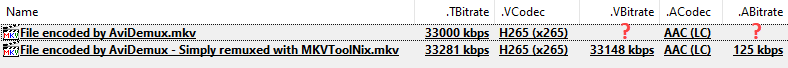
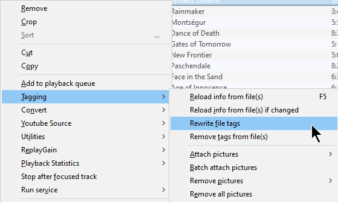
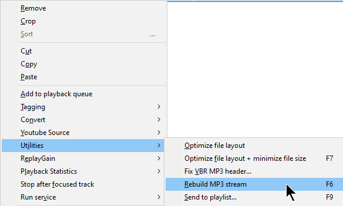

# Some Fields Are Missing, Help!

Q: Sometimes a Matroska file or another format does not show all expected fields,
and only some of the fields are shown. What gives?

A: This is a not script or MediaInfo per se, but an encoder/muxer problem.

This happens especially with bitrate fields. Some apps do not conform to container and/or
codec specifications fully or implement only part of or an older version of these,
and do not populate the missing fields correctly.

In such cases, it is recommended to "*repair*" the file with some helper tools.
For Matroska/MKV files MKVToolNix and for audio files Foobar2000 are highly recommended.

* MKVToolNix: Simply remux the file with a recent version of MKVToolNix.
This will upgrade the container.

* Foobar2000: Depending on the format, you can execute "Rewrite File Tags" and/or "Rebuild MP3 Stream" commands.

Example file encoded by AviDemux:

