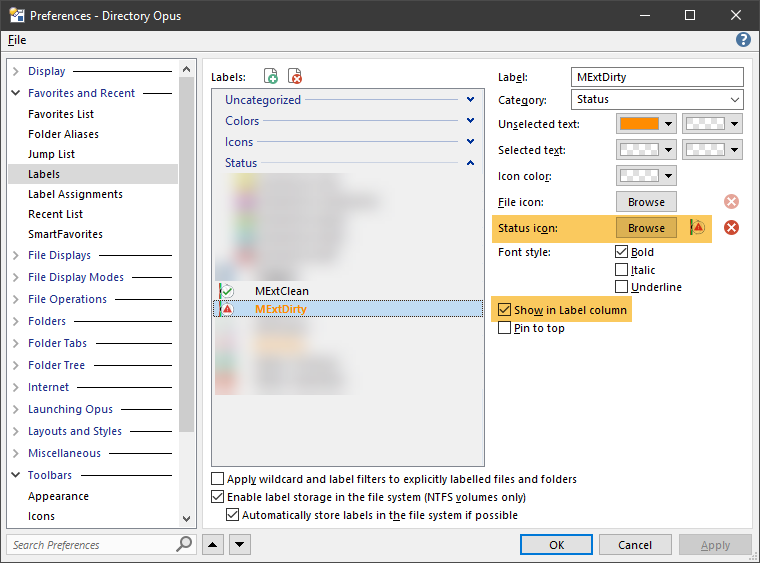
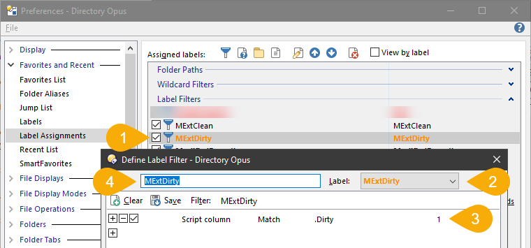
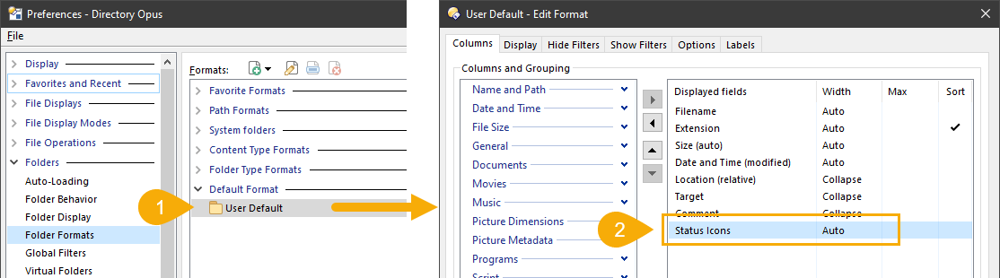
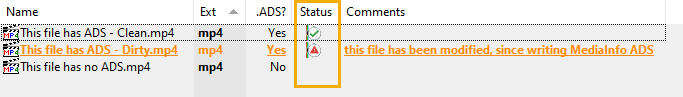
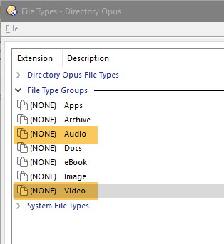
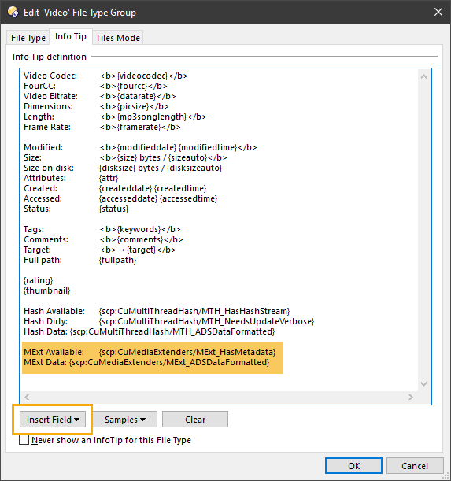
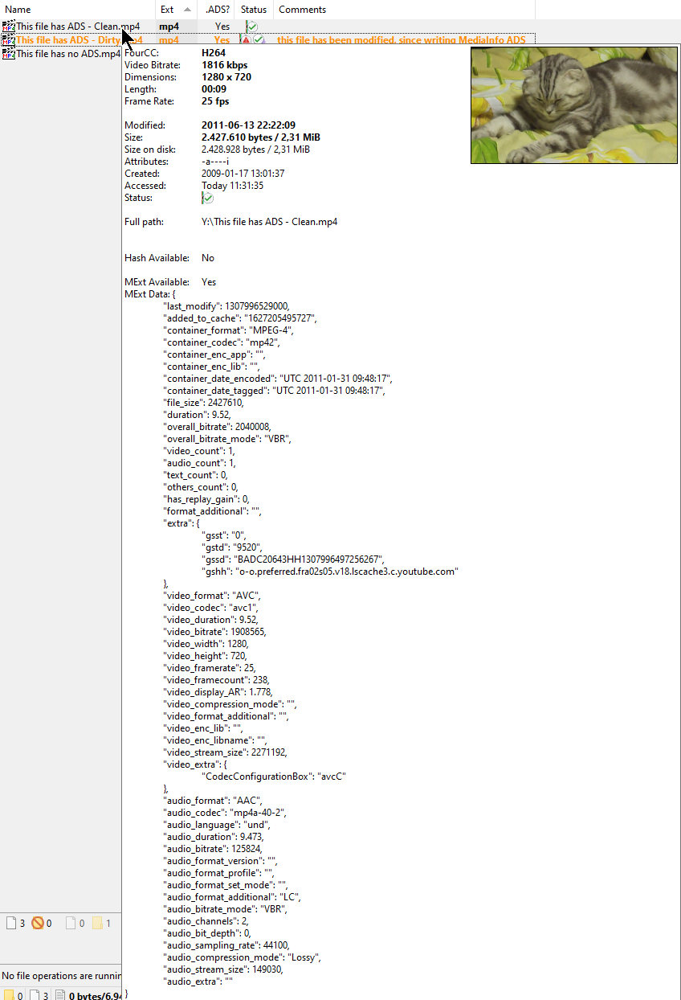

# How and where to use script columns

DOpus is an incredibly powerful and flexible file manager, and allows us to use *script fields*,
in many places, e.g. labels, rename scripts, searches, Infotips (tooltip), tiles, etc.

Here are a couple examples which I use daily.

## Labels & Status column

Labels are one of the under-estimated and most powerful features of DOpus.
They can be used standalone, but also can be used in "Status" columns. Here is how it is done.

Define 2 new Labels; an .ICL file with sample icons is in the distro.

*Note*: Label column is optional.

Assign the labels to a filter. The name in step 2 is the label name from above, the name in step 4 is the label filter name; in this case they are identical but must not be.

Add the status column in your lister, or change the default lister format.

*Note*: Status icons are stacked, i.e. if you have multiple status icons they will be shown next to each other.

Now the lister should show the "Status" column as follows.

# Infotips

Infotips (tooltips) are another very powerful feature of DOpus. This is how you could set them up to show the MediaInfo data.

Open the file types editor, and edit Video & Audio.

Select Infotip tab. You can use individual fields as {scp:CuMediaExtenders/MExt_HasMetadata} and/or the pre-formatted field {scp:CuMediaExtenders/MExt_ADSDataFormatted}. Additional fields can be added via "Insert Field".

The result looks like this:

