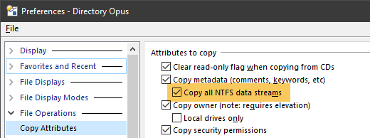

# Quick Start

* Extract the distro file if you haven't already
* Make sure you have MediaInfo **CLI** version downloaded from https://mediaarea.net/en/MediaInfo/Download/Windows
* Open DOpus
* Drag and drop the OSP file in Preferences -> Toolbars -> Scripts
* Click the script name or highlight it and click the gear-icon
* Adjust the path to MediaInfo CLI exe
* Close the Preferences window
* Change to toolbar customization mode
* Drag and drop the DCF file to your toolbar
* Close the customization mode
* Done!

Now you are ready to use the script columns wherever you want:
e.g. by right clicking the column header in your lister, choose "Columns -> Script -> Media Extenders" or use one of the Toggle buttons from the menu, or in Info Tips or Tiles via File Types customization.

Of course, don't forget to select some files and click the Update button to scan your files with MediaInfo ;)

## Optional
Included in the distro file is an ICL file which you can use as "Status Label" icons, to show clean/dirty status in the Status Column (DOpus accepts only .ICL, .ICO, .EXE... for label icons).

See the help section "How/Where To Use" for more info.

The Photoshop PSD template is also included, because why not?

## Recommended
Although not required, it is highly recommended to activate "copy all NTFS data streams" in DOpus settings.

